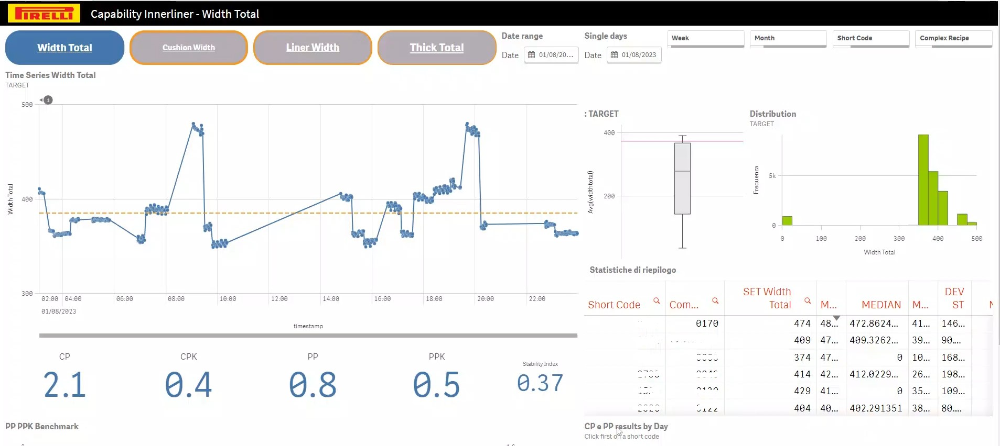
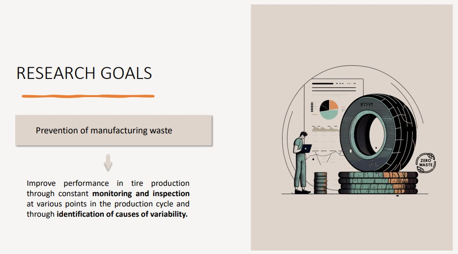
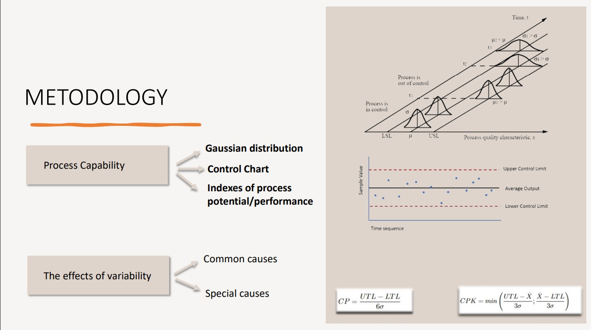
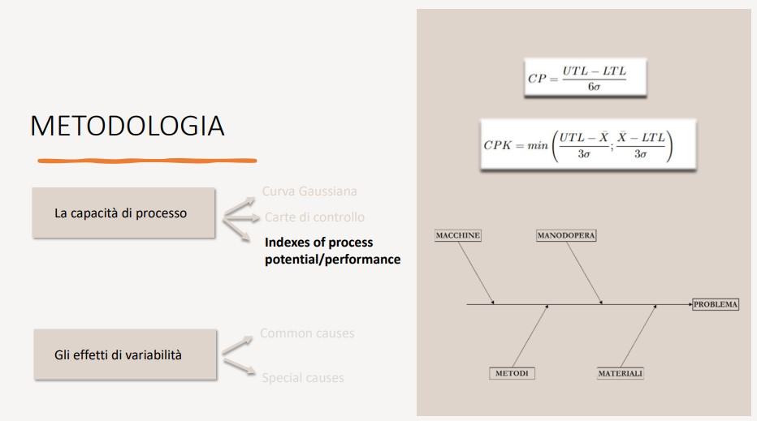
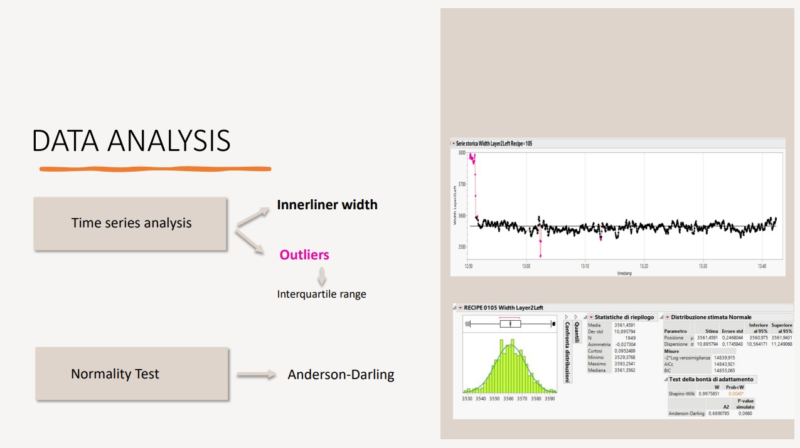
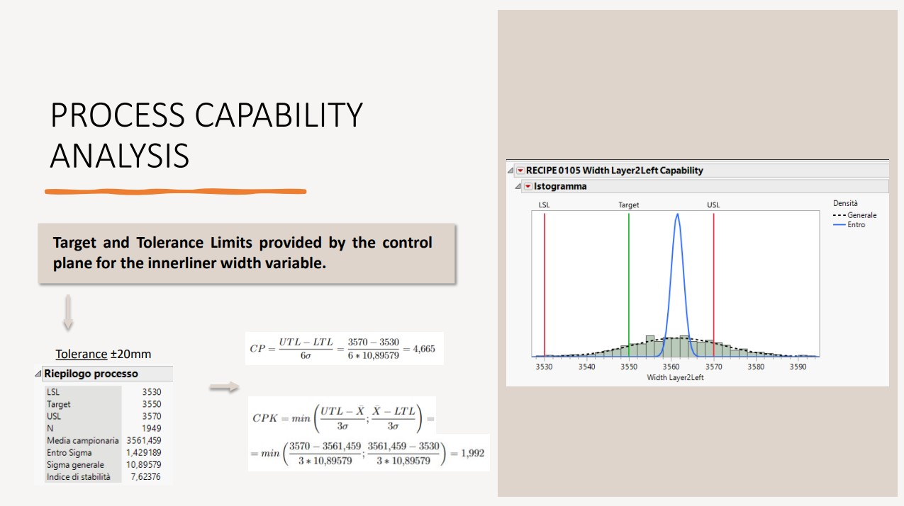
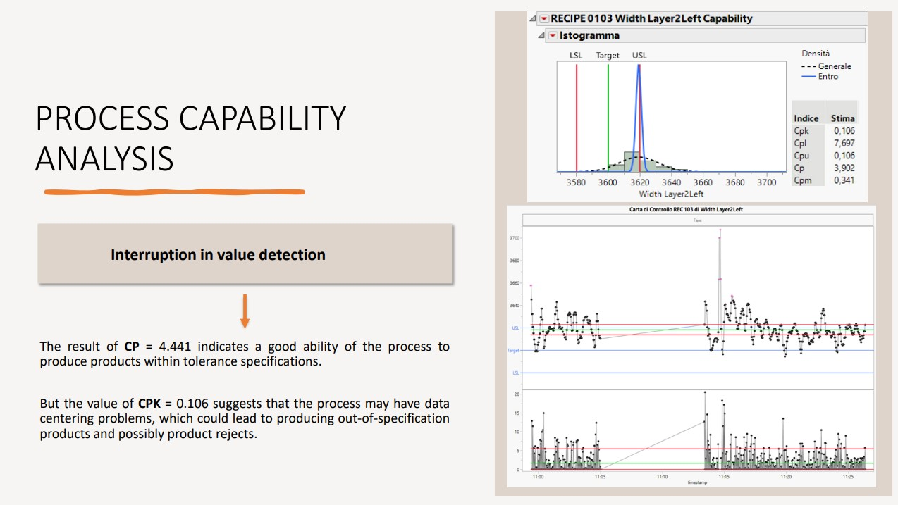
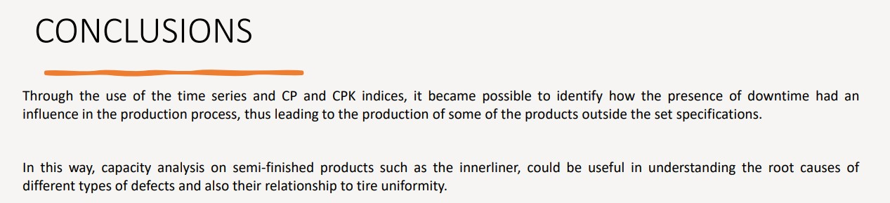

# Thesis Process Capability Project

The aim of this project was to minimize scrap in the production process. To achieve this, we developed a streamlined pipeline for managing sensor data and delivered a quality dashboard for monitoring purposes.

---
## Pipeline
In this project we obtain data directly from sensors. Initially, we analyzed the data using JMP to uncover patterns and trends. Once we determined the data processing approach, we developed a Python pipeline. This pipeline retrieves data from an IIoT AWS database and applies various preprocessing techniques. The resulting output is saved as Parquet files in the AWS database and subsequently processed by Qlik Sense.

## Result
This interactive dashboard was developed with the goal of controlling and reducing scrap in a production process. By filtering based on a date or a measurement, users can visualize the production time series, box plots, distributions, and process capability indices (CP, CPK, PP, PPK), which are essential for preventing product scrap.

## About The Project

❗❗❗ This project is not available to use because all the properties belongs to Pirelli
❗❗ All data in this github project is dummy (according to privacy rules) 
❗ The use of this project is for LaTeX or for Analysis consult

### Thesis Project in detail
This thesis focuses on analyzing the process involved in the production of tyres.

The objective of this work is to study how to prevent internal production waste at Pirelli's plant. 
The methodology used involved continuous monitoring of product quality and gaining a thorough understanding of the company's policy for managing nonconforming products, i.e., products that do not meet the required specifications. 

The research started with a comprehensive analysis of a series of samples related to innerliner production. Subsequently, by identifying the causes of variability and controlling the CP and CPK process indices, efforts were made to understand how to obtain products that conform to the specified technical requirements. The ultimate business goal is to ensure that the production and control process can consistently deliver conforming products.

You can see all the details in the thesis pdf.

### Author
Martina D'Angelo
---

## Built With

* Python
* Qlik Sense
* JMP

## Project Description

<!--  -->

---

## License

The images are distributed under the Pirelli License.

(<a href="#readme-top">back to top</a>)

