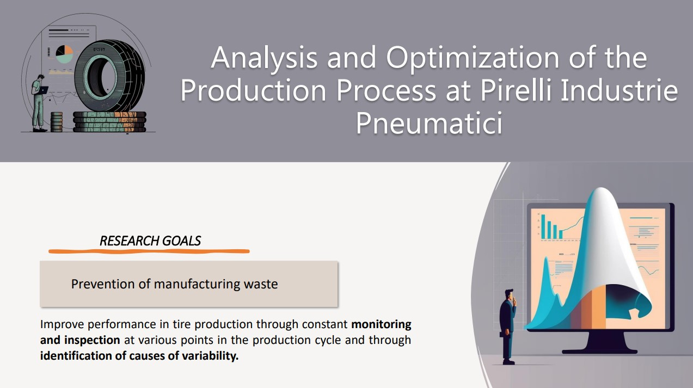
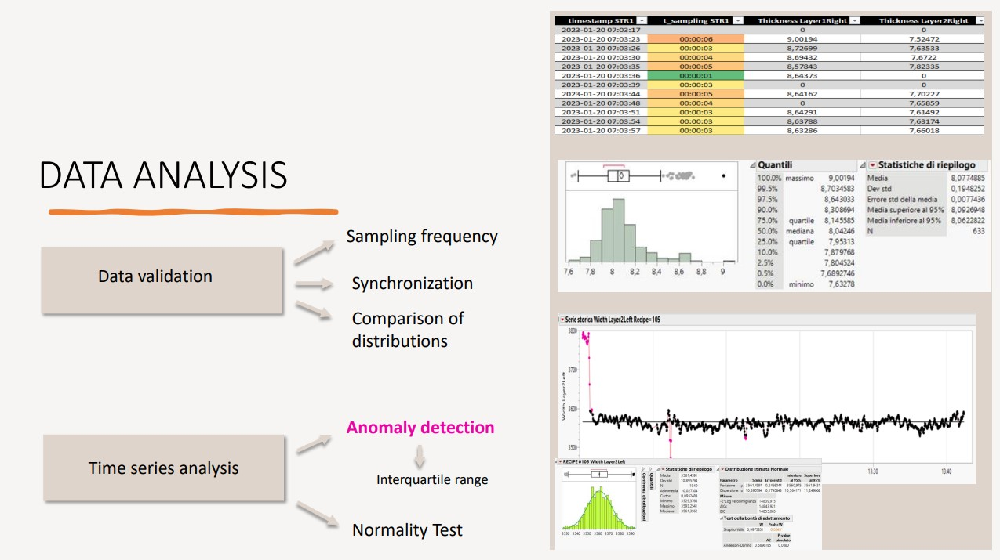

# Latex Thesis Process Capability Project

<!-- ## Table of Contents

- [About The Project](#about-the-project)
  - [Built With](#built-with)
  - [Project Description](#project-description)
- [License](#license) -->

---

## About The Project

❗❗❗ This project is not available to use because all the properties belongs to Pirelli

❗❗ All data in this github project is dummy (according to privacy rules) 

❗ The use of this project is for LaTeX or for Analysis consult

### Thesis project result 👉 📊 Qlik Sense Dashboard
This interactive dashboard was developed with the goal of controlling and reducing scrap in a production process. By filtering based on a date or a measurement, users can visualize the production time series, box plots, distributions, and process capability indices (CP, CPK, PP, PPK), which are essential for preventing product scrap.

  <h3 align="center">Process Capability Dashboard screenshot </h3>

#

---

### Thesis Project
This thesis focuses on analyzing the process involved in the production of tyres.

The objective of this work is to study how to prevent internal production waste at Pirelli's plant. 
The methodology used involved continuous monitoring of product quality and gaining a thorough understanding of the company's policy for managing nonconforming products, i.e., products that do not meet the required specifications. 

The research started with a comprehensive analysis of a series of samples related to innerliner production. Subsequently, by identifying the causes of variability and controlling the CP and CPK process indices, efforts were made to understand how to obtain products that conform to the specified technical requirements. The ultimate business goal is to ensure that the production and control process can consistently deliver conforming products.

---

## Built With

* Python
* Qlik Sense
* JMP

## Project Description

<!--  -->

---

## License

The images are distributed under the Pirelli License.

(<a href="#readme-top">back to top</a>)

